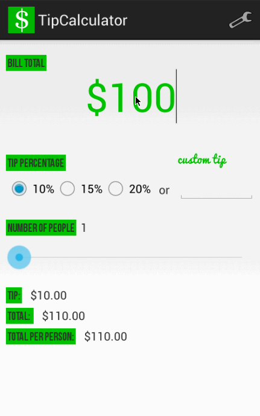

Tip-Calculator
==============

Tip Calculator utility app which allows a user to calculate the appropriate tip based on the total amount entered.

Time spent: 10 hours spent in total

Completed user stories:

 * [x] Required: User is displayed the tip of specified percentage for specified entered amount
 * [x] Required: User enters the total amount of the transaction
 * [x] Required: User can select between tip amounts (i.e 10%, 15%, 20%)
 * [x] Required: Upon selecting tip amount, formatted tip value is displayed
 * [x] Optional: User changes the total amount and updated tip is reflected automatically
 * [x] Optional: User can select custom tip percentage if desired
 * [x] Optional: User can select how many ways to split the tip
 * [x] Optional: User can edit preset tip percentages and have them persist across launches
 * [x] Optional: Experiment with trying input widgets to replace the buttons and/or textviews
 * [x] Optional: Improve the user interface and experience by using images and/or colors
 
Notes:
I tried to add a button to charge people on Venmo and it put the total per person amount as the amount to charge. It was almost working but there were some issues that I didn't have time to try to fix.

Walkthrough of all user stories:

GIF created with [LiceCap](http://www.cockos.com/licecap/).
