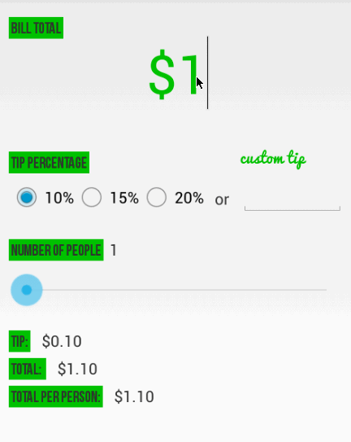

Tip-Calculator
==============
This is an Android demo application for displaying the latest box office movies using the [RottenTomatoes API](http://www.rottentomatoes.com/). See the [RottenTomatoes Networking Tutorial](http://guides.thecodepath.com/android/RottenTomatoes-Networking-Tutorial) on our cliffnotes for a step-by-step tutorial.

Time spent: 5 hours spent in total

Completed user stories:

 * [x] Required: User is displayed the tip of specified percentage for specified entered amount
 * [x] Required: User enters the total amount of the transaction
 * [x] Required: User can select between tip amounts (i.e 10%, 15%, 20%)
 * [x] Required: Upon selecting tip amount, formatted tip value is displayed
 * [x] Optional: User changes the total amount and updated tip is reflected automatically
 * [x] Optional: User changes the total amount and updated tip is reflected automatically
 *  * [x] Optional: User changes the total amount and updated tip is reflected automatically
Notes:

Spent some time making the UI work across multiple phone resolutions by playing around with the RelativeLayout.

Walkthrough of all user stories:

GIF created with [LiceCap](http://www.cockos.com/licecap/).

